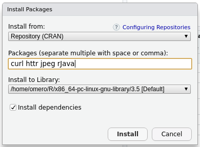

Installing and using romero.gateway package in RStudio
======================================================

Linux
-----

This example uses Debian 10. On other distributions the commands and packages 
might be called slightly differently.

As *root* user install the system dependencies:
``apt install r-base openjdk-11-jdk libssl-dev libcurl4-openssl-dev``

Then you need to find out where exactly the JDK was installed:
``ls -l /etc/alternatives/ | grep java``

Lookout for 'openjdk' to find the location.

Configure Java for R (still using *root* user)::

	export JAVA_HOME=/usr/lib/jvm/java-11-openjdk-amd64 # Whatever your path to openjdk is
	R CMD javareconf

As normal user install and start up RStudio.
In RStudio install the dependencies from CRAN needed for the romero.gateway package:

Alternative: Run the following in the console:
``install.packages(c("jpeg", "curl", "httr", "rJava"))``

Download the latest romero.gateway release tar.gz from `Github <https://github.com/ome/rOMERO-gateway/releases>`_.
Install it in RStudio:

.. image:: rstudio_romero.png

Alternative: Run the following in the console:
``install.packages("~/Downloads/romero.gateway_0.4.8.tar.gz", repos = NULL, type = "source")``

Windows
-------

This example uses Windows 10, other Windows version should be similar.

Install a JDK, for example `AdoptOpenJDK <https://adoptopenjdk.net>`_. Make sure to tick the
checkbox to set the `JAVA_HOME` and `PATH` environment variables!

Install the dependencies httr, jpeg and rJava from CRAN:

.. image:: windows_romero_deps.png

Download the latest romero.gateway release zip from `Github <https://github.com/ome/rOMERO-gateway/releases>`_
and install it:

.. image:: windows_romero.png
